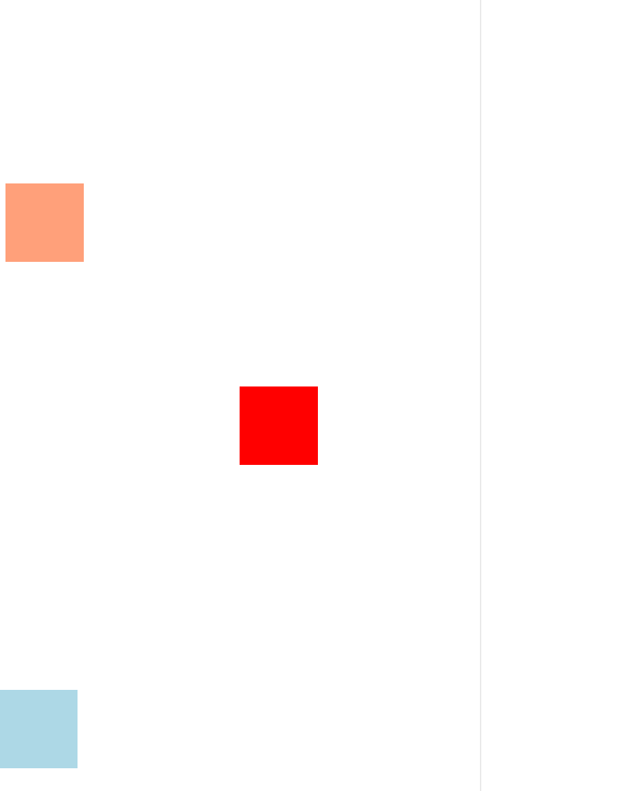

# 用约 60 行 JavaScript 实现购物车小球斜抛动画

## 前言

技术文章，尤其是前端技术文章具有时效性。

若文中出现 breaking change、事实错误或表述不当，欢迎在评论区或仓库 issue 中指出，以便后续读者少走弯路。

## 摘要

本文介绍一种基于 Web Animations API 的**元素斜抛动画**实现方式。

与常见写法相比，本文不采用 `@keyframes` 声明动画，也不在 HTML 中额外挂载占位节点，而是用 `class` 将 DOM 创建、样式与动画集中在 JavaScript 中处理，结构更紧凑、复用更方便。

使用方式示例：

```js
const moveBall = new MoveBall({ startDom, endDom })
moveBall.freeThrow()
```

## 效果预览



## 实现思路

实现分为三步。

**（1）** 读取起点与终点 DOM，换算为各自的中心坐标。

**（2）** 依据纵坐标高低关系，为垂直方向选择不同的 `cubic-bezier` 缓动，与水平方向的线性平移叠加，形成斜抛观感。

**（3）** 动画结束后移除临时 DOM，避免污染页面。

## 代码实现与用例

```js
// MoveBall.js
class MoveBall {
    constructor({ startDom, endDom }) {
        this.startXy = MoveBall.getCenterCoordinates(startDom);
        this.endXy = MoveBall.getCenterCoordinates(endDom);
        this.verticalDom = MoveBall.cerateVerticalDom(startDom);
        this.horizontalDom = MoveBall.createHorizontalDom();
        this.verticalDom.appendChild(this.horizontalDom);
    }
    static ballW = 30;
    static ballH = 30;
    static getCenterCoordinates(domElement) {
        const rect = domElement.getBoundingClientRect();
        const centerX = rect.left + rect.width / 2;
        const centerY = rect.top + rect.height / 2;
        return { x: centerX, y: centerY };
    }
    static cerateVerticalDom(startDom) {
        const startXy = MoveBall.getCenterCoordinates(startDom);
        const verticalDom = document.createElement('div');
        verticalDom.style.position = 'fixed';
        verticalDom.style.top = `${startXy.y - MoveBall.ballH / 2}px`;
        verticalDom.style.left = `${startXy.x - MoveBall.ballW / 2}px`;
        verticalDom.style.zIndex = '999';
        return verticalDom;
    }
    static createHorizontalDom() {
        const horizontalDom = document.createElement('div');
        horizontalDom.style.width = `${MoveBall.ballW}px`;
        horizontalDom.style.height = `${MoveBall.ballH}px`;
        horizontalDom.style.borderRadius = '50%';
        horizontalDom.style.background = 'lightgreen';
        return horizontalDom;
    }
    getOffsetXy() {
        return {
            x: this.endXy.x - this.startXy.x,
            y: this.endXy.y - this.startXy.y,
        };
    }
    freeThrow() {
        document.body.appendChild(this.verticalDom);
        let verticalEasing =
            this.startXy.y < this.endXy.y ? 'cubic-bezier(.44,-1.43,1,1)' : 'cubic-bezier(0,0,.76,1.92)';
        let verticalAnimate = this.verticalDom.animate(
            [{ transform: `translate3d(0, ${this.getOffsetXy().y}px, 0)` }],
            {
                easing: verticalEasing,
                duration: 800,
                iterations: 1,
            }
        );
        this.horizontalDom.animate([{ transform: `translate3d(${this.getOffsetXy().x}px, 0, 0)` }], {
            easing: 'linear',
            duration: 800,
            iterations: 1,
        });
        verticalAnimate.onfinish = () => {
            this.verticalDom.remove();
        };
    }
}
```

**用例**

```html
<!DOCTYPE html>
<html lang="en">
    <head>
        <meta charset="UTF-8" />
        <meta name="viewport" content="width=device-width, initial-scale=1.0" />
        <title>Document</title>
        <style>
            #d1,
            #d2,
            #d3 {
                width: 100px;
                height: 100px;
            }
            #d1 {
                background: lightsalmon;
                position: fixed;
                top: 30%;
            }
            #d2 {
                background: lightblue;
                position: fixed;
                top: 80%;
                left: 0;
            }
            #d3 {
                background: red;
                position: fixed;
                top: 50%;
                left: 50%;
            }
        </style>
    </head>
    <body>
        <div id="d1"></div>
        <div id="d2"></div>
        <div id="d3"></div>
        <script src="./MoveBall.js"></script>
        <script>
            const d1 = document.getElementById('d1');
            const d2 = document.getElementById('d2');
            const d3 = document.getElementById('d3');
            d1.onclick = function (e) {
                let moveball = new MoveBall({
                    startDom: d1,
                    endDom: d3,
                });
                moveball.freeThrow();
            };
            d2.onclick = function (e) {
                let moveball = new MoveBall({
                    startDom: d2,
                    endDom: d3,
                });
                moveball.freeThrow();
            };
        </script>
    </body>
</html>
```

## 斜抛观感来自运动分解

斜抛观感由水平匀速位移与垂直方向的缓动叠加得到。

水平方向使用线性 `translate3d`，持续时间与垂直动画一致。

垂直方向根据起点与终点的纵坐标关系选择不同 `cubic-bezier`。`getBoundingClientRect()` 的 `y` 越大表示元素在视口中越靠下，这一点在判断「高／低」时要特别注意。

**（1）** 起点纵坐标小于终点纵坐标：起点在终点上方。垂直方向可先略向上再落下，对应 `cubic-bezier(.44,-1.43,1,1)`。示意：纵坐标由 100 经约 80 再到 200。曲线可视化见 [cubic-bezier.com 上的 (.44,-1.43,1,1)](https://cubic-bezier.com/#.44,-1.43,1,1)。

**（2）** 起点纵坐标大于终点纵坐标：起点在终点下方。垂直方向可先到达终点附近再略 overshoot，对应 `cubic-bezier(0,0,.76,1.92)`。示意：纵坐标由 300 到 200 再到约 180 再回到 200。曲线可视化见 [cubic-bezier.com 上的 (0,0,.76,1.92)](https://cubic-bezier.com/#0,0,.76,1.92)。

## 总结

本文用 `Element.animate()` 将「创建小球节点、配置两段 transform、在结束时回收 DOM」串成一个小类，避免在模板层散落 `@keyframes` 与占位标签。熟悉 Web Animations API 后，同类交互动画可以更集中地维护。

## 参考文献

1. [Deja-vuuu / vue-ele（高仿饿了么教程示例）](https://github.com/Deja-vuuu/vue-ele)
2. [使用原生 Element.animate 实现文字与图片动画，掘金](https://juejin.cn/post/7037109871208038437)
3. [Animation，MDN Web API 文档](https://developer.mozilla.org/zh-CN/docs/Web/API/Animation)
4. [cubic-bezier.com 曲线示例 (.17,.67,.83,.67)](https://cubic-bezier.com/#.17,.67,.83,.67)
