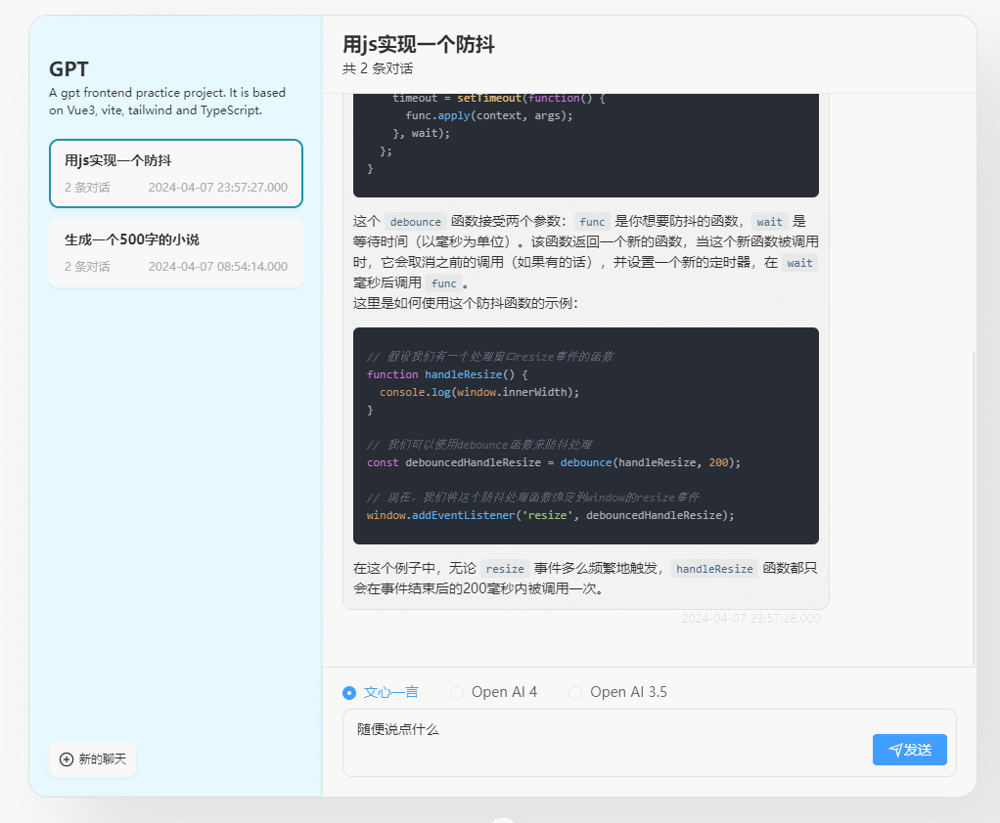

# 基于 Vue 3 的 ChatGPT 打字机效果前端实现（附代码）

## 前言

技术文章，尤其是前端技术文章具有时效性。

若文中出现 breaking change、事实错误或表述不当，欢迎在评论区或仓库 issue 中指出。

示例代码仓库：<https://github.com/JUST-Limbo/vue3-gpt-practice>

该仓库为前端演示工程，对话数据为 mock。若要接入 OpenAI 等真实大模型接口，需要自行替换请求层与鉴权逻辑。

## 摘要

本文说明「流式文本 + 打字机观感」在前端的一种实现思路，并给出光标定位的两种路线：在 DOM 上追加占位节点，或依赖 CSS 伪元素与选择器。

当前示例采用第一种方式：在 Markdown 渲染完成后，查找最后一个非空文本叶子节点，再在其后插入用于测量位置的临时文本节点，把光标元素定位到该坐标。

## 效果预览



## 队列与逐字渲染

可以把问题类比为「一边入队、一边出队」：接口或 mock 持续追加字符串，渲染侧按固定节拍消费队首字符并写回视图。

为便于集中管理状态，示例用 ES `class` 组织为 `Pipe`：

1. 用静态属性保存待渲染字符串与定时器句柄。
2. `write` 负责入队，`pop` 负责丢弃队首字符。
3. `start` 用定时器尾递归调用「渲染一个字符 + 出队」。
4. `consumeAll` 在流结束时一次性刷完剩余字符并清理状态，避免无意义的尾段节流。

```typescript
// views/home/cmp/chatInputPanel.vue
class Pipe {
    static str = ''
    static timer = 0
    static target: Nullable<Ref<gptMockNamespace.chatRecord>> = null
    static reset () {
        Pipe.str = ''
        clearInterval(Pipe.timer)
        unLockScroll()
        Pipe.target = null
    }
    static start (data: Ref<gptMockNamespace.chatRecord>) {
        Pipe.target = data
        function recursiveTimeoutFunction () {
            Pipe.timer = setTimeout(() => {
                Pipe.consume(Pipe.getFirstStr())
                Pipe.pop()
                recursiveTimeoutFunction()
            }, 50);
        }
        recursiveTimeoutFunction()
    }
    static write (chunk: string) {
        Pipe.str += chunk
    }
    static getFirstStr () {
        return Pipe.str[0]
    }
    static pop () {
        Pipe.str = Pipe.str.substring(1)
    }
    static consume (message: string = '') {
        const ans = Pipe.target
        if (!ans) {
            return
        }
        ans.value.message += message
        if (!chatWindowScollLock.value) {
            scrollToBottom()
        }
    }
    static consumeAll () {
        Pipe.consume(Pipe.str)
        Pipe.str = ''
        const t = Pipe.target
        if (t && t.value) {
            delete t.value.chatting
        }
        clearInterval(Pipe.timer)
    }
}
```

## 打字机光标实现

### 基于 DOM 测量光标位置

思路是：在 Markdown 容器内找到当前「最后一个非空文本叶子节点」，在其后面临时插入一个 `Text` 节点，用 `Range.getBoundingClientRect` 读出坐标，再映射到外层消息容器的相对位置，驱动绝对定位的光标元素。

```vue
// views/home/cmp/chatItemBot.vue
<script setup lang="ts">
import type { gptMockNamespace } from '@/api/interface/gptmock'

import markdown from '@/utils/markdownIt'
import { findLastNonEmptyTextNode } from '@/utils/DomUtils'

const chatMarkdownBody = ref()
const chatMessageContainer = ref()

const pos = reactive({ x: 0, y: 0 })

let textNode: Nullable<Text> = document.createTextNode('_')
function refreshPosXY () {
    const lastText = findLastNonEmptyTextNode(chatMarkdownBody.value)
    const parent = lastText ? lastText.parentNode : null
    if (parent && textNode) {
        parent.appendChild(textNode)
    }
    const range = document.createRange()
    if (textNode) {
        range.setStart(textNode, 0)
        range.setEnd(textNode, 0)
    }
    const textNodeRect = range.getBoundingClientRect()
    const containerRect = chatMessageContainer.value.getBoundingClientRect()
    pos.x = textNodeRect.left - containerRect.left
    pos.y = textNodeRect.top - containerRect.top
    if (textNode) {
        textNode.remove()
    }
}
onMounted(() => {
    refreshPosXY()
})
onUpdated(() => {
    refreshPosXY()
})
onBeforeUnmount(() => {
    textNode = null
})
</script>
<style lang="scss" scoped>
.blink {
    position: absolute;
    width: 10px;
    height: 2px;
    transform: translateY(13px);
    background: black;
    left: calc(v-bind('pos.x') * 1px);
    top: calc(v-bind('pos.y') * 1px);
    animation: blink 1s steps(5, start) infinite;
}
</style>
```

**边界说明**：当段落之后紧跟空的 `pre > code` 时，`findLastNonEmptyTextNode` 可能仍落在上一段末尾，而产品语义上更期待光标已进入代码块区域。要彻底消除该偏差，需要在遍历策略里为代码块等结构增加特判；示例为保持工具函数简单，未做硬编码分支。

### 基于 CSS 伪元素的光标

性能通常更好，做法是依赖 `:last-child` 等选择器，把闪烁样式挂在「当前块级结构的末尾子节点」上。

代价是：遇到复杂 DOM 结构或额外换行时，需要不断补充选择器与覆盖规则，可维护性略差。

```scss
// styles/highlight.scss
@mixin FlashingCursor {
  animation: blink 1s steps(5, start) infinite;
  content: '▋';
  margin-left: 0.25rem;
  vertical-align: baseline;
}

@keyframes blink {
  0%,
  100% {
    opacity: 0;
  }

  25%,
  50% {
    opacity: 1;
  }
}

.chat-markdown-body-rendering {
  &:empty:after {
    content: '思考中...';
    animation: blink 1s steps(5, start) infinite;
    margin-left: 0.25rem;
    vertical-align: baseline;
  }

  > :not(ol):not(ul):not(pre):last-child:after,
  > pre:last-child code:after,
  > ol:last-child li:last-child:after,
  > ul:last-child li:last-child:after {
    @include FlashingCursor;
  }
}
```

## 总结

打字机本体是队列消费与视图更新的组合；光标则是「如何可靠地找到当前渲染锚点」的问题。`markdown-it` 与 `highlight.js` 生态成熟，按文档接入即可。若需更多灵感，可在视频站点检索「CSS 打字机」等关键词，社区已有大量可视化案例。

## 参考文献

1. [ChatGPT Next Web](https://github.com/ChatGPTNextWeb/ChatGPT-Next-Web)
2. [markdown-it](https://github.com/markdown-it/markdown-it)
3. [highlight.js 官网](https://highlightjs.org/)
4. [highlight.js 中文资料站](https://fenxianglu.cn/highlight.html)
5. [相关实现讨论，掘金](https://juejin.cn/post/7237426124669157433)
