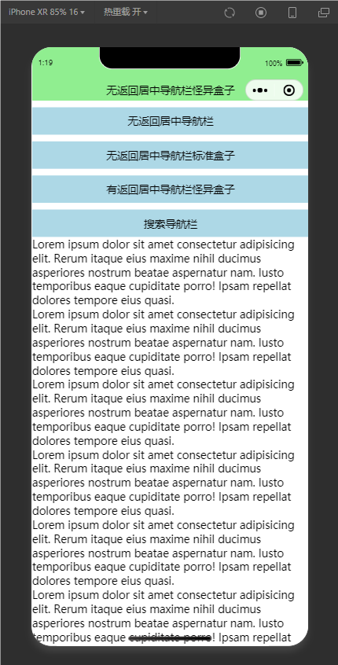
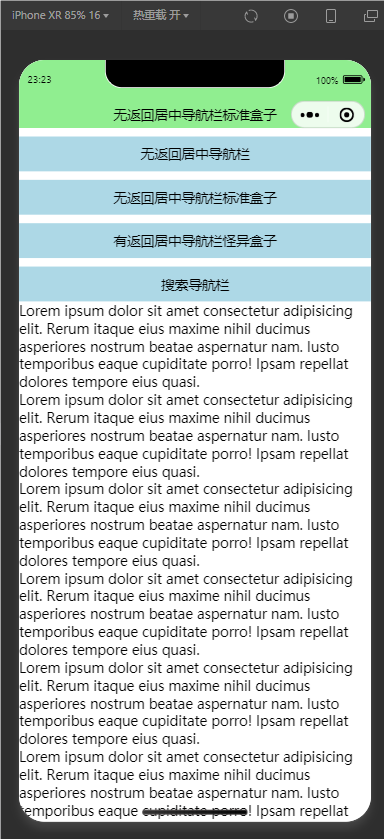
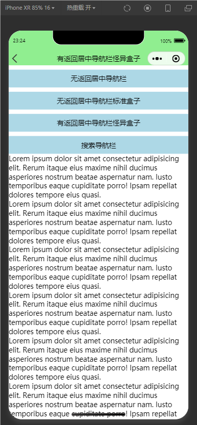
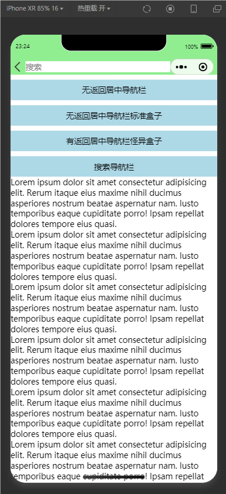
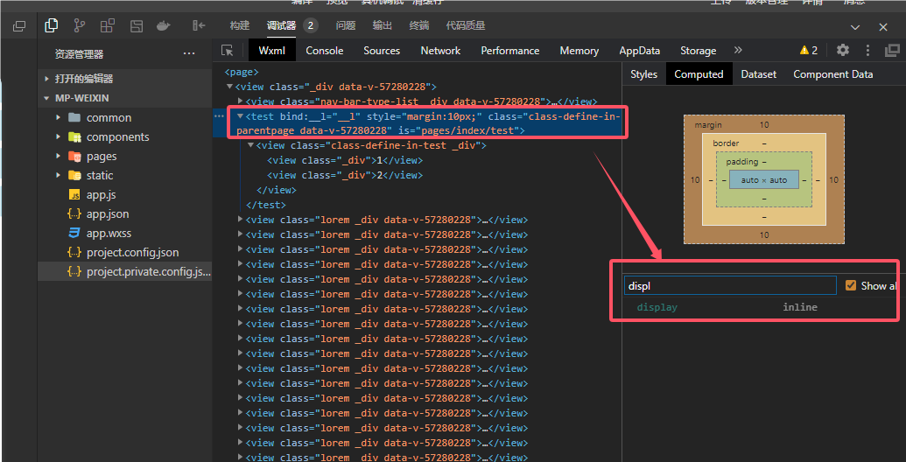

# 基于 uni-app 的自定义导航栏与小程序胶囊适配

## 前言

技术文章，尤其是前端技术文章具有时效性。

若文中出现 breaking change、事实错误或表述不当，欢迎在评论区或仓库 issue 中指出。

## 摘要

本文说明 uni-app 编译到小程序后，页面使用自定义导航栏时，如何对齐与避让右上角「胶囊」菜单区域。

网上已有大量成熟公式，本文与其他资料在数值推导上基本一致。本文更想强调一点：胶囊布局信息在单设备上通常不变，适合在应用启动阶段读取一次，并放入 Vuex 或 Pinia 等状态容器中复用，而不是在每个页面的 `onLoad`、`created` 里重复拉取与拼装。

## 效果预览

|  |  |  |  |
| --- | --- | --- | --- |

## 尺寸与内边距推算

常用结论如下。

**（1）** 自定义导航栏整体高度可取：

**胶囊上边界坐标 + 胶囊高度**

**（2）** 若希望导航栏内容与胶囊垂直对齐，可令：

**导航栏上内边距 = 胶囊上边界坐标**

此时建议将导航栏 `box-sizing` 设为 `border-box`，避免高度计算与边框、内边距打架。

**（3）** 若希望正文区域不被右侧胶囊遮挡，可令：

**导航栏右内边距 = 屏幕宽度 − 胶囊左边界坐标**

## 机型差异与兼容性注意

部分 Android 机型上，`uni.getMenuButtonBoundingClientRect` 返回的 `top`、`right` 等值可能偏大。上线前请在真机上多机型核对导航栏与胶囊的对齐情况。

## 数据的获取时机

不少示例会在 `created`、`mounted`、`onLoad`、`onReady`、`onLaunch` 中读取胶囊信息，再写入本页 `data`。也可以把初始化前移到 `data()` 函数体里，或集中到全局 store，减少重复代码。

### 在 data 中直接初始化

```vue
<script>
export default {
	data() {
		const { windowWidth } = uni.getWindowInfo()
		const { top, height, left } = uni.getMenuButtonBoundingClientRect()
		return {
			navBarHeight: top + height,
			menuHeight: height,
			menuTop: top,
			menuLeft: windowWidth - left
		}
	}
}
</script>
```

### 在 Vuex 中组织初始化代码

应用入口中执行一次 `store.commit("menuButtonLayout/init")`，示例：

```js
// store/modules/menuButtonLayout.js
export default {
	namespaced: true,
	state: () => ({
		statusBarHeight: 0,
		navBarHeight: 0,
		menuHeight: 0,
		menuTop: 0,
		menuRight: 0,
		menuWidth: 0
	}),
	mutations: {
		init(state) {
			const { statusBarHeight, windowWidth } = uni.getWindowInfo()
			const { top, height, right, width, left } = uni.getMenuButtonBoundingClientRect()
			state.statusBarHeight = statusBarHeight
			state.navBarHeight = top + height // 也可额外 +10 预留底部空隙
			state.menuHeight = height
			state.menuWidth = width
			state.menuTop = top
			state.menuRight = windowWidth - right
			state.menuLeft = windowWidth - left
		}
	}
}

// store/index.js
import Vue from "vue"
import Vuex from "vuex"
import menuButtonLayout from "./modules/menuButtonLayout"
Vue.use(Vuex)
const store = new Vuex.Store({
	state: {},
	modules: {
		menuButtonLayout
	}
})
export default store

// main.js
import App from "./App"
import Vue from "vue"
import store from "./store"
Vue.config.productionTip = false
App.mpType = "app"
store.commit("menuButtonLayout/init")
const app = new Vue({
	...App,
	store
})
app.$mount()
```

### 在 Pinia 中组织初始化代码

```js
// stores/menuButtonLayout.js
import { defineStore } from "pinia"
import { ref } from "vue"

export const useMenuButtonLayoutStore = defineStore("menuButtonLayout", () => {
	const { statusBarHeight, windowWidth } = uni.getWindowInfo()
	const { top, height, right, width, left } = uni.getMenuButtonBoundingClientRect()
	return {
		statusBarHeight: ref(statusBarHeight),
		navBarHeight: ref(top + height),
		menuHeight: ref(height),
		menuWidth: ref(width),
		menuTop: ref(top),
		menuRight: ref(windowWidth - right),
		menuLeft: ref(windowWidth - left)
	}
})
```

## Vue 2 用例

```vue
<template>
	<div>
		<div
			v-if="curNavBarType === 1"
			class="nav-bar nav-bar1"
			:style="{
				boxSizing: 'border-box',
				height: navBarHeight + 'px',
				lineHeight: menuHeight + 'px',
				paddingTop: menuTop + 'px',
				textAlign: 'center'
			}"
		>
			无返回居中导航栏怪异盒子
		</div>
		<div
			v-else-if="curNavBarType === 2"
			class="nav-bar nav-bar2"
			:style="{
				height: menuHeight + 'px',
				lineHeight: menuHeight + 'px',
				paddingTop: menuTop + 'px',
				textAlign: 'center'
			}"
		>
			无返回居中导航栏标准盒子
		</div>
		<div
			v-else-if="curNavBarType === 3"
			class="nav-bar nav-bar3"
			:style="{
				boxSizing: 'border-box',
				height: navBarHeight + 'px',
				lineHeight: menuHeight + 'px',
				paddingTop: menuTop + 'px',
				textAlign: 'center'
			}"
		>
			<uni-icons type="back" size="30" style="position: absolute; left: 0"></uni-icons>
			有返回居中导航栏怪异盒子
		</div>
		<div
			v-else-if="curNavBarType === 4"
			class="nav-bar nav-bar4"
			:style="{
				boxSizing: 'border-box',
				height: navBarHeight + 'px',
				paddingTop: menuTop + 'px',
				paddingRight: menuLeft + 'px',
				display: 'flex',
				alignItems: 'center'
			}"
		>
			<uni-icons type="back" size="30"></uni-icons>
			<input type="text" placeholder="搜索" style="flex: 1; background: #fff" />
		</div>
		<div class="nav-bar-type-list">
			<div class="nav-bar-type-item" @click="curNavBarType = 1">无返回居中导航栏</div>
			<div class="nav-bar-type-item" @click="curNavBarType = 2">无返回居中导航栏标准盒子</div>
			<div class="nav-bar-type-item" @click="curNavBarType = 3">有返回居中导航栏怪异盒子</div>
			<div class="nav-bar-type-item" @click="curNavBarType = 4">搜索导航栏</div>
		</div>
		<div class="lorem" v-for="i in 20" :key="i">
			Lorem ipsum dolor sit amet consectetur adipisicing elit. Rerum itaque eius maxime nihil ducimus asperiores nostrum beatae aspernatur nam. Iusto temporibus eaque cupiditate porro! Ipsam repellat dolores tempore eius quasi.
		</div>
	</div>
</template>

<script>
import { mapState } from "vuex"
export default {
	data() {
		return {
			curNavBarType: 1
		}
	},
	computed: {
		...mapState("menuButtonLayout", ["navBarHeight", "menuTop", "menuHeight", "menuLeft"])
	}
}
</script>

<style lang="scss" scoped>
.nav-bar {
	position: sticky;
	top: 0;
	left: 0;
	background-color: lightgreen;
}
.nav-bar-type-list {
	.nav-bar-type-item {
		margin-top: 10px;
		padding: 10px;
		background-color: lightblue;
		text-align: center;
	}
}
</style>
```

## Vue 3 用例

```vue
<template>
	<div>
		<div
			v-if="curNavBarType === 1"
			class="nav-bar nav-bar1"
			:style="{
				boxSizing: 'border-box',
				height: navBarHeight + 'px',
				lineHeight: menuHeight + 'px',
				paddingTop: menuTop + 'px',
				textAlign: 'center'
			}"
		>
			无返回居中导航栏怪异盒子
		</div>
		<div
			v-else-if="curNavBarType === 2"
			class="nav-bar nav-bar2"
			:style="{
				height: menuHeight + 'px',
				lineHeight: menuHeight + 'px',
				paddingTop: menuTop + 'px',
				textAlign: 'center'
			}"
		>
			无返回居中导航栏标准盒子
		</div>
		<div
			v-else-if="curNavBarType === 3"
			class="nav-bar nav-bar3"
			:style="{
				boxSizing: 'border-box',
				height: navBarHeight + 'px',
				lineHeight: menuHeight + 'px',
				paddingTop: menuTop + 'px',
				textAlign: 'center'
			}"
		>
			<uni-icons type="back" size="30" style="position: absolute; left: 0"></uni-icons>
			有返回居中导航栏怪异盒子
		</div>
		<div
			v-else-if="curNavBarType === 4"
			class="nav-bar nav-bar4"
			:style="{
				boxSizing: 'border-box',
				height: navBarHeight + 'px',
				paddingTop: menuTop + 'px',
				paddingRight: menuLeft + 'px',
				display: 'flex',
				alignItems: 'center'
			}"
		>
			<uni-icons type="back" size="30"></uni-icons>
			<input type="text" placeholder="搜索" style="flex: 1; background: #fff" />
		</div>
		<div class="nav-bar-type-list">
			<div class="nav-bar-type-item" @click="curNavBarType = 1">无返回居中导航栏</div>
			<div class="nav-bar-type-item" @click="curNavBarType = 2">无返回居中导航栏标准盒子</div>
			<div class="nav-bar-type-item" @click="curNavBarType = 3">有返回居中导航栏怪异盒子</div>
			<div class="nav-bar-type-item" @click="curNavBarType = 4">搜索导航栏</div>
		</div>
		<div class="lorem" v-for="i in 20" :key="i">
			Lorem ipsum dolor sit amet consectetur adipisicing elit. Rerum itaque eius maxime nihil ducimus asperiores nostrum beatae aspernatur nam. Iusto temporibus eaque cupiditate porro! Ipsam repellat dolores tempore eius quasi.
		</div>
	</div>
</template>

<script setup>
import { ref } from "vue"
import { storeToRefs } from "pinia"

import { useMenuButtonLayoutStore } from "@/stores/menuButtonLayout"

const menuButtonLayoutStore = useMenuButtonLayoutStore()
const { navBarHeight, menuHeight, menuTop, menuLeft } = storeToRefs(menuButtonLayoutStore)

const curNavBarType = ref(1)
</script>

<style lang="scss" scoped>
.nav-bar {
	position: sticky;
	top: 0;
	left: 0;
	background-color: lightgreen;
}
.nav-bar-type-list {
	.nav-bar-type-item {
		margin-top: 10px;
		padding: 10px;
		background-color: lightblue;
		text-align: center;
	}
}
</style>
```

## 是否要封装通用导航栏组件



uni-app 编译到小程序后，自定义组件在节点树上的表现与 H5 不同：外层会多一层自定义组件标签，且默认是行内元素。行内元素上可能出现「上下 `margin` 生效、左右 `margin` 不生效」等与直觉不一致的现象。

此外，小程序自定义组件默认不会把外层传入的 `class` 与内层根节点自动合并，调试时要注意父页样式与组件根节点样式的关系。

为减少跨端差异，可阅读官方文档中的 `virtualHost`、`mergeVirtualHostAttributes` 等配置项：

- [uni-app 文档：其他配置（Vue 3 API）](https://uniapp.dcloud.net.cn/tutorial/vue3-api.html#其他配置)
- [manifest.json 应用配置（含各小程序端字段）](https://uniapp.dcloud.net.cn/collocation/manifest.html#mp-weixin)
- [微信小程序：自定义组件与虚拟化节点](https://developers.weixin.qq.com/miniprogram/dev/framework/custom-component/wxml-wxss.html#虚拟化组件节点)

在 `navigationStyle: "custom"` 场景下，产品形态往往变化较快。除非已确认多页复用同一套导航栏结构，否则不必过早抽象「大一统」导航栏组件，以免被个别页面的特殊布局拖垮。

## 总结

若业务暂不考虑宽屏、横屏等形态，单台设备上的胶囊几何通常固定。胶囊数据只需在应用启动时读取一次并写入全局状态即可，无需在每个页面生命周期里重复调用 API。

## 参考文献

1. [优雅解决 uni-app 微信小程序右上角胶囊菜单覆盖问题，掘金](https://juejin.cn/post/7309361597556719679)
2. [uni-app 标题水平对齐微信小程序胶囊按钮及适配，CSDN](https://blog.csdn.net/weixin_42220130/article/details/139981343)
